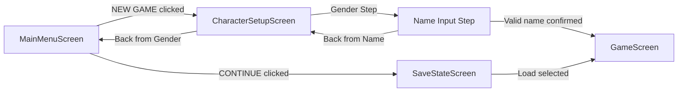
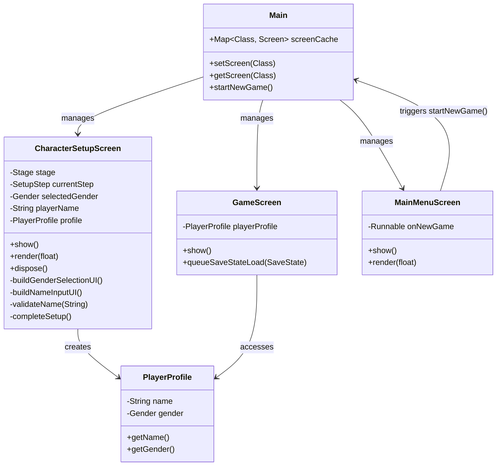
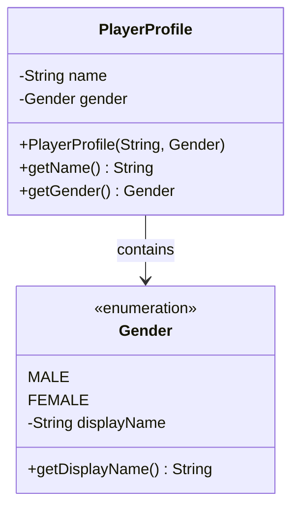

# Design Document: Character Setup Flow

## Overview

The character setup flow introduces a two-step character creation process that occurs between the main menu and game start. Players will select their character's gender and enter a name before beginning gameplay. This feature integrates with the existing LibGDX screen management system and maintains compatibility with the current save/load architecture.

### Design Goals

1. **Seamless Integration**: Fit naturally into the existing screen flow (MainMenuScreen → CharacterSetupScreen → GameScreen)
2. **Consistent UI**: Match the dark fantasy aesthetic and styling of MainMenuScreen
3. **Future-Ready**: Design PlayerProfile data model to support future save state integration
4. **Non-Invasive**: Avoid modifying existing game systems (battle, inventory, save/load)

### Key Design Decisions

- **Two-Step Flow**: Separate gender selection and name input into distinct steps for clarity
- **Scene2D UI**: Use LibGDX's Scene2D framework for consistency with existing screens
- **Screen Cache Pattern**: Register CharacterSetupScreen in Main's screen cache like other screens
- **Validation-First**: Prevent progression with invalid input rather than allowing and correcting
- **Singleton Profile**: PlayerProfile accessible from GameScreen for future use

## Architecture

### Screen Flow Diagram



### Component Relationships



### Integration Points

1. **Main.startNewGame()**: Modified to transition to CharacterSetupScreen instead of GameScreen
2. **CharacterSetupScreen.completeSetup()**: Creates PlayerProfile and transitions to GameScreen
3. **GameScreen.show()**: Accesses PlayerProfile (if present) for future use
4. **Screen Cache**: CharacterSetupScreen registered in Main.create()

## Components and Interfaces

### CharacterSetupScreen

**Responsibilities:**

- Display gender selection UI (step 1)
- Display name input UI (step 2)
- Validate player name input
- Create PlayerProfile with selected data
- Manage screen transitions

**Key Methods:**

```java
public class CharacterSetupScreen implements Screen {
    private final Main game;
    private final Stage stage;
    private final Batch batch;

    // State
    private SetupStep currentStep;
    private Gender selectedGender;
    private String playerName;
    private PlayerProfile profile;

    // UI Components
    private Table genderTable;
    private Table nameTable;
    private TextField nameField;
    private Label errorLabel;

    // Fonts (matching MainMenuScreen style)
    private BitmapFont titleFont;
    private BitmapFont buttonFont;
    private BitmapFont labelFont;

    public CharacterSetupScreen(Main game, Batch batch);

    @Override
    public void show();

    @Override
    public void render(float delta);

    @Override
    public void dispose();

    private void buildGenderSelectionUI();
    private void buildNameInputUI();
    private void transitionToNameInput();
    private void transitionToGenderSelection();
    private boolean validateName(String name);
    private void showError(String message);
    private void clearError();
    private void completeSetup();
    private TextButtonStyle createButtonStyle();
    private void loadFonts();
    private void drawBackground();
}
```

**UI Layout (Gender Selection Step):**

```
┌─────────────────────────────────────┐
│                                     │
│         CHARACTER CREATION          │
│                                     │
│         Select Your Gender          │
│                                     │
│         ┌──────────┐                │
│         │   MALE   │                │
│         └──────────┘                │
│                                     │
│         ┌──────────┐                │
│         │  FEMALE  │                │
│         └──────────┘                │
│                                     │
│         ┌──────────┐                │
│         │   BACK   │                │
│         └──────────┘                │
│                                     │
└─────────────────────────────────────┘
```

**UI Layout (Name Input Step):**

```
┌─────────────────────────────────────┐
│                                     │
│         CHARACTER CREATION          │
│                                     │
│        Enter Your Name              │
│                                     │
│         ┌──────────────┐            │
│         │ [Text Field] │            │
│         └──────────────┘            │
│                                     │
│         [Error message here]        │
│                                     │
│    ┌──────────┐  ┌──────────┐      │
│    │   BACK   │  │  START   │      │
│    └──────────┘  └──────────┘      │
│                                     │
└─────────────────────────────────────┘
```

**State Management:**

```java
private enum SetupStep {
    GENDER_SELECTION,
    NAME_INPUT
}
```

The screen maintains internal state to track which step is currently displayed. Transitions between steps rebuild the UI table.

### PlayerProfile

**Responsibilities:**

- Store player's chosen name and gender
- Provide accessors for game systems
- Support future save state integration

**Implementation:**

```java
public class PlayerProfile {
    private String name;
    private Gender gender;

    public PlayerProfile(String name, Gender gender) {
        this.name = name;
        this.gender = gender;
    }

    public String getName() {
        return name;
    }

    public Gender getGender() {
        return gender;
    }

    // TODO: Future save state integration
    // public void populateSaveState(SaveState saveState) {
    //     saveState.setPlayerName(name);
    //     saveState.setPlayerGender(gender.name());
    // }

    // TODO: Future save state loading
    // public static PlayerProfile fromSaveState(SaveState saveState) {
    //     return new PlayerProfile(
    //         saveState.getPlayerName(),
    //         Gender.valueOf(saveState.getPlayerGender())
    //     );
    // }
}
```

### Gender Enum

**Responsibilities:**

- Define available gender options
- Provide display labels

**Implementation:**

```java
public enum Gender {
    MALE("Male"),
    FEMALE("Female");

    private final String displayName;

    Gender(String displayName) {
        this.displayName = displayName;
    }

    public String getDisplayName() {
        return displayName;
    }
}
```

## Data Models

### PlayerProfile Data Model



**Field Specifications:**

| Field  | Type   | Constraints                                        | Description                      |
| ------ | ------ | -------------------------------------------------- | -------------------------------- |
| name   | String | Non-null, non-empty after trim, no whitespace-only | Player's chosen character name   |
| gender | Gender | Non-null, must be MALE or FEMALE                   | Player's chosen character gender |

### Future Save State Integration

The SaveState class currently does not contain player metadata fields. When save state integration is implemented, the following fields should be added:

```java
// Future additions to SaveState class
private String playerName;
private String playerGender;  // Stored as string for JSON compatibility

public String getPlayerName() { return playerName; }
public void setPlayerName(String playerName) { this.playerName = playerName; }
public String getPlayerGender() { return playerGender; }
public void setPlayerGender(String playerGender) { this.playerGender = playerGender; }
```

## Error Handling

### Name Validation

**Validation Rules:**

1. **Empty Check**: Name cannot be empty string after trimming
2. **Whitespace Check**: Name cannot consist only of whitespace characters
3. **Trim Operation**: Leading and trailing whitespace is removed before validation

**Validation Logic:**

```java
private boolean validateName(String name) {
    if (name == null) {
        showError("Name cannot be empty");
        return false;
    }

    String trimmed = name.trim();

    if (trimmed.isEmpty()) {
        showError("Name cannot be empty");
        return false;
    }

    // Additional validation can be added here
    // e.g., length limits, character restrictions

    return true;
}
```

**Error Display:**

- Error messages appear in a Label below the TextField
- Error text color: Red (#FF4444)
- Error label is cleared when user modifies the TextField
- Error label is cleared when user navigates back

### Input Handling

**Keyboard Shortcuts:**

| Key    | Action               | Context              |
| ------ | -------------------- | -------------------- |
| Enter  | Confirm current step | Name input step only |
| Escape | Go back              | Both steps           |

**Implementation:**

```java
// In render() method
if (currentStep == SetupStep.NAME_INPUT) {
    if (Gdx.input.isKeyJustPressed(Keys.ENTER)) {
        // Trigger confirm button action
        completeSetup();
    }
}

if (Gdx.input.isKeyJustPressed(Keys.ESCAPE)) {
    if (currentStep == SetupStep.NAME_INPUT) {
        transitionToGenderSelection();
    } else {
        game.setScreen(MainMenuScreen.class);
    }
}
```

### Screen Lifecycle

**Resource Management:**

```java
@Override
public void dispose() {
    stage.dispose();
    if (titleFont != null) titleFont.dispose();
    if (buttonFont != null) buttonFont.dispose();
    if (labelFont != null) labelFont.dispose();
    if (backgroundTexture != null) backgroundTexture.dispose();
}
```

**Input Processor:**

```java
@Override
public void show() {
    Gdx.input.setInputProcessor(stage);
    // Reset to gender selection step when screen is shown
    currentStep = SetupStep.GENDER_SELECTION;
    selectedGender = null;
    playerName = null;
    buildGenderSelectionUI();
}
```

## Testing Strategy

### Testing Approach

This feature is primarily UI-focused with screen navigation and state management. The testing strategy emphasizes:

1. **Unit Tests**: Specific validation logic and state transitions
2. **Integration Tests**: Screen flow and interaction with existing systems
3. **Manual Testing**: UI rendering, styling consistency, and user experience

**Property-based testing is NOT appropriate for this feature** because:

- Most requirements involve UI rendering and visual consistency
- Screen navigation is deterministic with specific examples
- Integration points test "does not break existing behavior"
- Only 2 acceptance criteria involve universal properties (name validation)

### Unit Testing

**Name Validation Tests:**

```java
@Test
public void testEmptyNameRejected() {
    CharacterSetupScreen screen = new CharacterSetupScreen(mockGame, mockBatch);
    assertFalse(screen.validateName(""));
}

@Test
public void testWhitespaceOnlyNameRejected() {
    CharacterSetupScreen screen = new CharacterSetupScreen(mockGame, mockBatch);
    assertFalse(screen.validateName("   "));
    assertFalse(screen.validateName("\t\t"));
    assertFalse(screen.validateName("\n\n"));
    assertFalse(screen.validateName("  \t \n  "));
}

@Test
public void testValidNameAccepted() {
    CharacterSetupScreen screen = new CharacterSetupScreen(mockGame, mockBatch);
    assertTrue(screen.validateName("Hero"));
    assertTrue(screen.validateName("  Hero  ")); // Should trim
}

@Test
public void testNameTrimming() {
    CharacterSetupScreen screen = new CharacterSetupScreen(mockGame, mockBatch);
    screen.setPlayerName("  Hero  ");
    assertEquals("Hero", screen.getPlayerName().trim());
}
```

**State Transition Tests:**

```java
@Test
public void testGenderSelectionToNameInput() {
    CharacterSetupScreen screen = new CharacterSetupScreen(mockGame, mockBatch);
    screen.show();
    assertEquals(SetupStep.GENDER_SELECTION, screen.getCurrentStep());

    screen.selectGender(Gender.MALE);
    screen.confirmGenderSelection();

    assertEquals(SetupStep.NAME_INPUT, screen.getCurrentStep());
    assertEquals(Gender.MALE, screen.getSelectedGender());
}

@Test
public void testBackFromNameInputToGenderSelection() {
    CharacterSetupScreen screen = new CharacterSetupScreen(mockGame, mockBatch);
    screen.show();
    screen.selectGender(Gender.FEMALE);
    screen.confirmGenderSelection();

    screen.goBack();

    assertEquals(SetupStep.GENDER_SELECTION, screen.getCurrentStep());
    // Gender selection should be preserved
    assertEquals(Gender.FEMALE, screen.getSelectedGender());
}

@Test
public void testCannotProgressWithoutGenderSelection() {
    CharacterSetupScreen screen = new CharacterSetupScreen(mockGame, mockBatch);
    screen.show();

    // Attempt to confirm without selecting gender
    screen.confirmGenderSelection();

    // Should remain on gender selection step
    assertEquals(SetupStep.GENDER_SELECTION, screen.getCurrentStep());
}
```

**PlayerProfile Tests:**

```java
@Test
public void testPlayerProfileCreation() {
    PlayerProfile profile = new PlayerProfile("Hero", Gender.MALE);
    assertEquals("Hero", profile.getName());
    assertEquals(Gender.MALE, profile.getGender());
}

@Test
public void testGenderDisplayName() {
    assertEquals("Male", Gender.MALE.getDisplayName());
    assertEquals("Female", Gender.FEMALE.getDisplayName());
}
```

### Integration Testing

**Screen Navigation Tests:**

```java
@Test
public void testNewGameTransitionsToCharacterSetup() {
    Main game = new Main();
    game.create();

    MainMenuScreen mainMenu = game.getScreen(MainMenuScreen.class);
    mainMenu.clickNewGame();

    assertTrue(game.getScreen() instanceof CharacterSetupScreen);
}

@Test
public void testCharacterSetupTransitionsToGameScreen() {
    Main game = new Main();
    game.create();
    game.setScreen(CharacterSetupScreen.class);

    CharacterSetupScreen setupScreen = game.getScreen(CharacterSetupScreen.class);
    setupScreen.selectGender(Gender.MALE);
    setupScreen.confirmGenderSelection();
    setupScreen.setPlayerName("Hero");
    setupScreen.confirmNameInput();

    assertTrue(game.getScreen() instanceof GameScreen);
}

@Test
public void testBackFromCharacterSetupToMainMenu() {
    Main game = new Main();
    game.create();
    game.setScreen(CharacterSetupScreen.class);

    CharacterSetupScreen setupScreen = game.getScreen(CharacterSetupScreen.class);
    setupScreen.goBack();

    assertTrue(game.getScreen() instanceof MainMenuScreen);
}
```

**Game Initialization Tests:**

```java
@Test
public void testGameStartsAtCottageAfterCharacterSetup() {
    Main game = new Main();
    game.create();

    // Complete character setup
    CharacterSetupScreen setupScreen = game.getScreen(CharacterSetupScreen.class);
    setupScreen.selectGender(Gender.MALE);
    setupScreen.confirmGenderSelection();
    setupScreen.setPlayerName("Hero");
    setupScreen.confirmNameInput();

    // Verify game screen initialized correctly
    GameScreen gameScreen = game.getScreen(GameScreen.class);
    assertEquals(MapAsset.COTTAGE_SAMPLE, gameScreen.getCurrentMap());
}

@Test
public void testPlayerProfileAccessibleFromGameScreen() {
    Main game = new Main();
    game.create();

    // Complete character setup
    CharacterSetupScreen setupScreen = game.getScreen(CharacterSetupScreen.class);
    setupScreen.selectGender(Gender.FEMALE);
    setupScreen.confirmGenderSelection();
    setupScreen.setPlayerName("Heroine");
    setupScreen.confirmNameInput();

    // Verify profile accessible
    GameScreen gameScreen = game.getScreen(GameScreen.class);
    PlayerProfile profile = gameScreen.getPlayerProfile();
    assertNotNull(profile);
    assertEquals("Heroine", profile.getName());
    assertEquals(Gender.FEMALE, profile.getGender());
}
```

**Regression Tests (Existing Functionality):**

```java
@Test
public void testContinueButtonStillWorks() {
    Main game = new Main();
    game.create();

    MainMenuScreen mainMenu = game.getScreen(MainMenuScreen.class);
    mainMenu.clickContinue();

    // Should transition to SaveStateScreen, not CharacterSetupScreen
    assertTrue(game.getScreen() instanceof SaveStateScreen);
}

@Test
public void testExitButtonStillWorks() {
    Main game = new Main();
    game.create();

    MainMenuScreen mainMenu = game.getScreen(MainMenuScreen.class);
    // Mock Gdx.app.exit() to verify it's called
    mainMenu.clickExit();

    verify(mockGdxApp).exit();
}

@Test
public void testSaveLoadNotAffected() {
    Main game = new Main();
    game.create();

    // Load a save state
    SaveState saveState = createTestSaveState();
    game.setScreen(GameScreen.class);
    GameScreen gameScreen = game.getScreen(GameScreen.class);
    gameScreen.queueSaveStateLoad(saveState);

    // Verify save state loaded correctly (existing behavior)
    assertEquals(saveState.getMapKey(), gameScreen.getCurrentMapKey());
    assertEquals(saveState.getPlayerX(), gameScreen.getPlayerX(), 0.01f);
    assertEquals(saveState.getPlayerY(), gameScreen.getPlayerY(), 0.01f);
}
```

### Manual Testing Checklist

**UI Consistency:**

- [ ] Font styles match MainMenuScreen (earthbound-dialogue-gold.otf)
- [ ] Button colors match MainMenuScreen (gold/orange theme)
- [ ] Background matches MainMenuScreen (dark gradient with vignette)
- [ ] Button hover effects work correctly
- [ ] Button click effects work correctly

**Gender Selection Step:**

- [ ] Two buttons labeled "Male" and "Female" are displayed
- [ ] Clicking a gender button visually indicates selection
- [ ] Confirm button appears after gender selection
- [ ] Back button returns to MainMenuScreen
- [ ] Cannot progress without selecting a gender

**Name Input Step:**

- [ ] TextField accepts keyboard input
- [ ] TextField has visible cursor
- [ ] Confirm button labeled "Start" or "Confirm"
- [ ] Back button returns to gender selection step
- [ ] Enter key triggers confirm action
- [ ] Escape key triggers back action

**Name Validation:**

- [ ] Empty name shows error message
- [ ] Whitespace-only name shows error message
- [ ] Valid name clears error message
- [ ] Error message appears below TextField
- [ ] Error message is red and readable

**Screen Transitions:**

- [ ] NEW GAME button transitions to CharacterSetupScreen
- [ ] Completing setup transitions to GameScreen
- [ ] Back from gender selection returns to MainMenuScreen
- [ ] Back from name input returns to gender selection
- [ ] CONTINUE button still works (goes to SaveStateScreen)
- [ ] EXIT GAME button still works (exits application)

**Game Initialization:**

- [ ] Player spawns in Cottage after character setup
- [ ] Game initializes with default inventory
- [ ] Game initializes with starting money
- [ ] No save state is created automatically

**Responsive Design:**

- [ ] UI scales correctly at 1920x1080
- [ ] UI scales correctly at 1280x720
- [ ] UI scales correctly at 800x600
- [ ] Buttons remain clickable at all resolutions
- [ ] Text remains readable at all resolutions

## Implementation Notes

### Code Location

```
core/src/main/java/github/dluckycompany/clawkins/
├── ui/
│   ├── CharacterSetupScreen.java (NEW)
│   └── MainMenuScreen.java (MODIFIED)
├── model/
│   ├── PlayerProfile.java (NEW)
│   └── Gender.java (NEW)
├── Main.java (MODIFIED)
└── GameScreen.java (MODIFIED)
```

### Modification Summary

**Main.java:**

- Modify `startNewGame()` to transition to CharacterSetupScreen instead of GameScreen
- Add CharacterSetupScreen to screen cache in `create()`

**MainMenuScreen.java:**

- No changes required (already calls `onNewGame.run()`)

**GameScreen.java:**

- Add `PlayerProfile playerProfile` field
- Add `setPlayerProfile(PlayerProfile profile)` method
- Add `getPlayerProfile()` method
- No changes to initialization logic

### Dependencies

- LibGDX Scene2D (already in use)
- FreeTypeFontGenerator (already in use)
- No new external dependencies required

### Performance Considerations

- Font generation occurs once in `loadFonts()` method
- Background texture created once and reused
- UI tables rebuilt only on step transitions
- No performance impact on existing game systems

### Accessibility Considerations

- Keyboard shortcuts (Enter, Escape) for all actions
- Clear visual feedback for selections
- Error messages displayed prominently
- Large, readable fonts
- High contrast colors

## Future Enhancements

### Save State Integration

When player metadata is added to save states:

1. Add `playerName` and `playerGender` fields to SaveState class
2. Implement `PlayerProfile.populateSaveState(SaveState)` method
3. Implement `PlayerProfile.fromSaveState(SaveState)` static method
4. Modify `GameScreen.buildSaveState()` to include player profile
5. Modify `GameScreen.applySaveState()` to restore player profile

### Additional Gender Options

To add more gender options:

1. Add new enum values to Gender enum
2. Update CharacterSetupScreen UI to display additional buttons
3. No other changes required (system is data-driven)

### Character Customization

Future character customization features could extend this system:

- Appearance selection (sprite selection)
- Starting stats allocation
- Background/origin selection
- Difficulty selection

These would add new steps to the CharacterSetupScreen flow without requiring architectural changes.

### Name Length Limits

Currently no length limits are enforced. Future enhancement:

```java
private static final int MIN_NAME_LENGTH = 1;
private static final int MAX_NAME_LENGTH = 20;

private boolean validateName(String name) {
    String trimmed = name.trim();

    if (trimmed.length() < MIN_NAME_LENGTH) {
        showError("Name is too short");
        return false;
    }

    if (trimmed.length() > MAX_NAME_LENGTH) {
        showError("Name is too long (max " + MAX_NAME_LENGTH + " characters)");
        return false;
    }

    return true;
}
```

### Character Restrictions

Future enhancement to restrict special characters:

```java
private boolean validateName(String name) {
    String trimmed = name.trim();

    if (!trimmed.matches("[a-zA-Z0-9 ]+")) {
        showError("Name can only contain letters, numbers, and spaces");
        return false;
    }

    return true;
}
```
